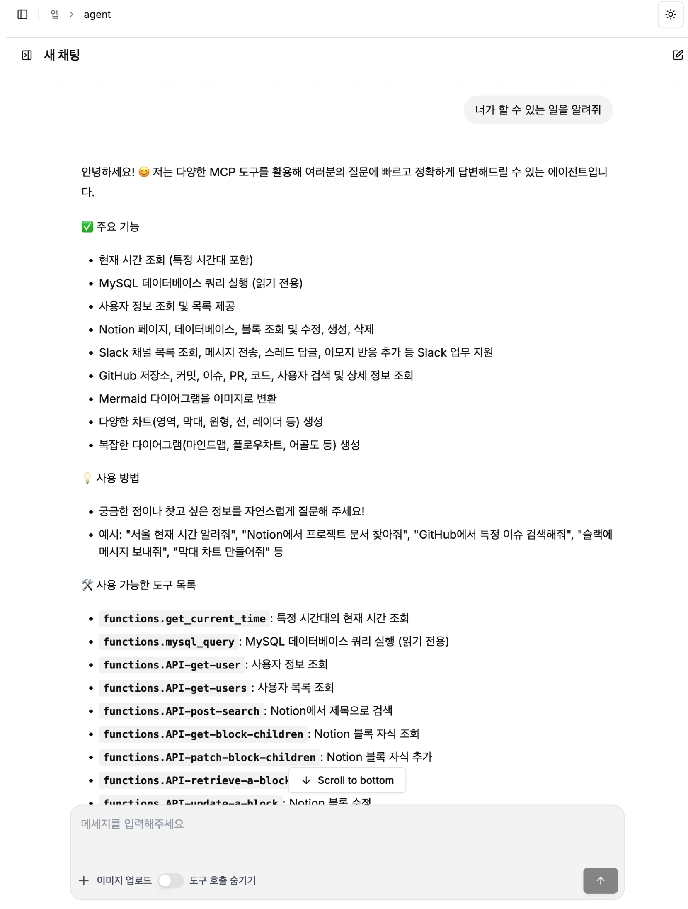

# MCP Agents with Collaboration Tools


[![Open in - LangGraph Studio](https://img.shields.io/badge/Open_in-LangGraph_Studio-00324d.svg?logo=data:image/svg%2bxml;base64,PHN2ZyB4bWxucz0iaHR0cDovL3d3dy53My5vcmcvMjAwMC9zdmciIHdpZHRoPSI4NS4zMzMiIGhlaWdodD0iODUuMzMzIiB2ZXJzaW9uPSIxLjAiIHZpZXdCb3g9IjAgMCA2NCA2NCI+PHBhdGggZD0iTTEzIDcuOGMtNi4zIDMuMS03LjEgNi4zLTYuOCAyNS43LjQgMjQuNi4zIDI0LjUgMjUuOSAyNC41QzU3LjUgNTggNTggNTcuNSA1OCAzMi4zIDU4IDcuMyA1Ni43IDYgMzIgNmMtMTIuOCAwLTE2LjEuMy0xOSAxLjhtMzcuNiAxNi42YzIuOCAyLjggMy40IDQuMiAzLjQgNy42cy0uNiA0LjgtMy40IDcuNkw0Ny4yIDQzSDE2LjhsLTMuNC0zLjRjLTQuOC00LjgtNC44LTEwLjQgMC0xNS4ybDMuNC0zLjRoMzAuNHoiLz48cGF0aCBkPSJNMTguOSAyNS42Yy0xLjEgMS4zLTEgMS43LjQgMi41LjkuNiAxLjcgMS44IDEuNyAyLjcgMCAxIC43IDIuOCAxLjYgNC4xIDEuNCAxLjkgMS40IDIuNS4zIDMuMi0xIC42LS42LjkgMS40LjkgMS41IDAgMi43LS41IDIuNy0xIDAtLjYgMS4xLS44IDIuNi0uNGwyLjYuNy0xLjgtMi45Yy01LjktOS4zLTkuNC0xMi4zLTExLjUtOS44TTM5IDI2YzAgMS4xLS45IDIuNS0yIDMuMi0yLjQgMS41LTIuNiAzLjQtLjUgNC4yLjguMyAyIDEuNyAyLjUgMy4xLjYgMS41IDEuNCAyLjMgMiAyIDEuNS0uOSAxLjItMy41LS40LTMuNS0yLjEgMC0yLjgtMi44LS44LTMuMyAxLjYtLjQgMS42LS41IDAtLjYtMS4xLS4xLTEuNS0uNi0xLjItMS42LjctMS43IDMuMy0yLjEgMy41LS41LjEuNS4yIDEuNi4zIDIuMiAwIC43LjkgMS40IDEuOSAxLjYgMi4xLjQgMi4zLTIuMy4yLTMuMi0uOC0uMy0yLTEuNy0yLjUtMy4xLTEuMS0zLTMtMy4zLTMtLjUiLz48L3N2Zz4=)](https://langgraph-studio.vercel.app/templates/open?githubUrl=https://github.com/langchain-ai/react-agent)

## 프로젝트 개요

`MCP Agents with Collaboration Tools`는 Model Context Protocol(MCP)기반으로 현업에서 주로 사용하는 협업 도구를 포함한 프로젝트입니다. 
이 프로젝트는 Teddy님의 `LangGraph Dynamic MCP Agents` 프로젝트를 기반으로 합니다.

### 목표
개인이 사용한다면 smithery로 간단하게 설치해서 사용하는 것이 가능하지만 조직에서 구성원들과 함께 사용할 Agent를 구현시에는 권한 문제나 보안 관련 요구사항들이 발생합니다.
이러한 문제를 해결하기 위해 tool의 코드를 리뷰하고 요구사항 구현이 필요하기 때문에 local에 설치해서 stdio 방식으로 실행합니다.
또한, 코드 레벨에서 사용하는 tool을 선별할 수 있기 때문에 적절한 수의 tool을 사용할 수 있어 성능에 기여합니다.  
이 프로젝트에 연동된 협업 도구들은 같은 목적의 도구들과 비교해서 실제 동작하고 혹시 모를 어뷰징이 없는 것으로 선택했으며 현업에 사용하고 있습니다.

### 연동된 협업 도구
* **Notion** : 노션(Notion) 페이지, 데이터베이스, 블록 조회 및 수정 등
* **Slack** : 채널 메시지 조회, 전송, 반응 추가 등
* **Github** : 저장소, 이슈, PR, 코드, 사용자 검색 및 상세 정보 조회
* **MySQL(DB)** : MySQL 데이터베이스 쿼리 실행 (읽기 전용)
* **Chart** : 다양한 차트(막대, 선, 원형, 히스토그램 등) 생성
* **Mermaid** : 순서도 및 다이어그램 생성



### 협업 도구 활용 예제
```bash
[Slack]
- slack을 사용해서 XXXX 채널에 오늘 작성된 메시지를 요약해줘

[MySQL(DB)]
- mysql을 사용해서 users 테이블의 last_logged_in 컬럼을 참고해서 오늘 로그인한 활성사용자 수를 알려줘 

[Mermaid(순서도 작성)]
- mermaid를 사용해서 중고물품거래 플랫폼에서 사용자의 거래 과정을 순서도로 그려줘

[Notion + Slack]
- notion을 사용해서 제목이 'XXXXXX'인 페이지를 찾고 내용을 요약해줘
- 요약한 메시지를 XXXX 채널에 작성해줘

[Github + Notion]
- github를 사용해서 XXXXX repo에서 최근 커밋된 내용과 작성자를 찾아줘
- 수정된 파일 링크를 리스트로 보여주고 notion을 사용해서 'XXXX repo 커밋 현황'이라는 제목으로 페이지를 작성해줘

[MySQL(DB) + Chart]
- mysql을 사용해서 products 테이블의 total_price 컬럼을 참고해서 판매금액 상위 5개 상품 이름과 가격을 알려줘
- 이 정보를 참고해서 chart를 사용해서 pi chart를 그려줘

[Notion + mermaid(순서도 작성)]
- notion을 사용해서 제목이 'XXXXXX'인 페이지를 찾아줘
- 문서 본문에서 '유저 플로우' 관련 내용을 찾고 순서도로 그려줘
```

## 설치 방법

1. 저장소 복제하기

```bash
git clone https://github.com/cserock/mcp-agents-with-collaboration-tools.git
cd mcp-agents-with-collaboration-tools
```

2. tool 설치 (resources 디렉토리 하위의 각 tool에 대해 아래 작업을 실행합니다. 단, mcp-server-chart, mcp-server-mermaid 2개의 툴은 해당 사항이 없습니다.)

`.env.example` 파일을 `.env`로 복사하고 필요한 API 키나 설정을 추가합니다.
```bash
cp .env.example .env
```
라이브러리를 설치하고 빌드합니다.
```bash
npm install
npm run build
```

## Agent 실행 준비
### 1. LLM 설정 
`.env` 파일에서 `LLM_PROVIDER` 를 설정합니다.

선택 가능(택 1): `ANTHROPIC`, `OPENAI`, `AZURE_OPENAI`

```
LLM_PROVIDER=AZURE_OPENAI
```

아래는 필요한 API 키 목록입니다. (선택한 `LLM_PROVIDER` 에 따라 설정합니다)

`Anthropic`, `OpenAI`, `Azure OpenAI` 에서 사용할 API 키를 설정합니다.(반드시 하나의 모델은 설정되어야 합니다.)

- `ANTHROPIC_API_KEY`: Anthropic API 키
- `OPENAI_API_KEY`: OpenAI API 키
- `AZURE_OPENAI_API_KEY`: Azure OpenAI API 키
- `AZURE_OPENAI_ENDPOINT`: Azure OpenAI 엔드포인트

### 2. Prompt 수정
prompts 디렉토리 하위의  `system_prompt.yaml`를 각 협업 도구 설정에 맞게 프롬프트를 작성합니다.

### 3. MCP 도구 설정

`mcp-config` 폴더에 있는 `mcp_config.json` 파일을 기준으로 모델이 사용할 MCP 도구를 설정합니다.
따라서, 미리 사용하고자 하는 MCP 도구를 JSON 형식으로 설정해 둘 수 있습니다.
이 과정은 도구 설정 대시보드에서도 설정이 가능합니다.
참고로, 협업 도구들의 설정은 이미 작성되어 있습니다.

아래는 샘플로 작성된 예시입니다.

```json
{
  "mcpServers": {
    "perplexity-search": {
      "command": "npx",
      "args": [
        "-y",
        "@smithery/cli@latest",
        "run",
        "@arjunkmrm/perplexity-search",
        "--key",
        "SMITHERY_API_KEY 를 입력하세요"
      ],
      "transport": "stdio"
    },
    "get_current_time": {
      "command": "python",
      "args": [
        "/app/resources/mcp_server_time.py"
      ],
      "transport": "stdio"
    }
  }
}
```

## Agent 실행

모든 설정이 완료되었다면, 다음 명령어로 실행할 수 있습니다.

> Windows(PowerShell)

```bash
docker compose build --no-cache; docker-compose up -d
```

> Mac / Linux

```bash
docker compose build --no-cache && docker-compose up -d
```

**접속 주소**

- TeddyFlow 연동: https://teddyflow.com/
- 채팅 인터페이스: `http://localhost:2024`
- 도구 설정 대시보드: `http://localhost:2025`

## teddyflow.com 연결 방법


1. teddyflow.com 에서 회원가입을 합니다.

회원가입시 "베타 키" 에 `teddynote-youtube` 를 입력하면 승인 없이 바로 가입이 가능합니다.


2. 로그인 후 "새로운 앱 연결" 버튼을 클릭합니다.


3. 앱 이름을 입력하고 "연결" 버튼을 클릭합니다.
4. 탭에서 "LangGraph" 를 선택한 뒤 다음의 정보를 입력합니다.
- Endpoint: `http://localhost:2024`
- Graph: `agent`


5. 연결 설정이 완료되면 "저장" 버튼을 클릭합니다.

6. "앱 연결하기" 버튼을 눌러 저장합니다.

## 회사명 / 커뮤니티 로고 및 브랜딩 적용

회사명 / 커뮤니티를 위한 커스텀 기능을 출시하였습니다.


도입을 희망하신다면 service@brain-crew.com 으로 문의주시면 도움을 드리겠습니다.


## 라이센스

Apache License 2.0 ([LICENSE](LICENSE))